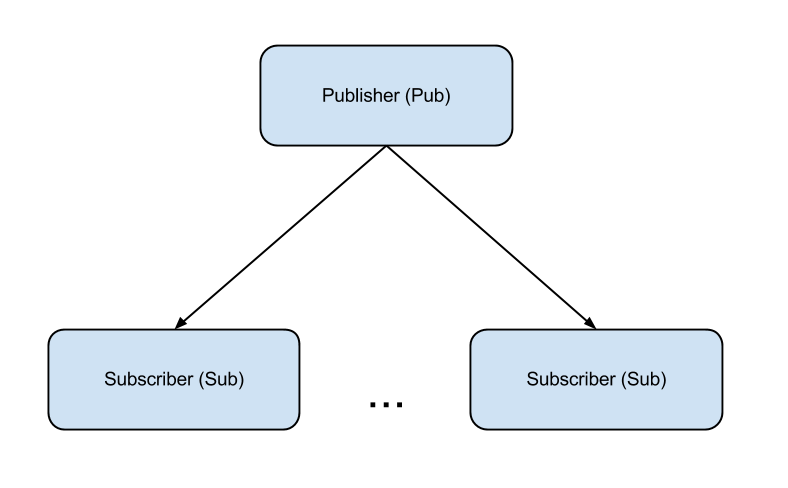

Pub-Sub
========
1 publisher sends messages to N subscribers.
###Usage:
<pre><code>python client.py
python server.py
</code></pre>
If you run `server.py` before `client.py`, some messages from publisher will be lost.

You can run many clients and add them dynamically. 

<pre><code>python client.py
python server.py
python client.py
…
python client.py
</code></pre>

After subscriber connects to the server, it won't receive messages that were sent before. 

