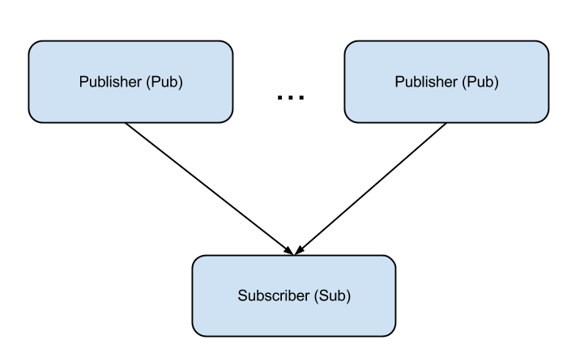

Pub-Sub
========
N publishers send messages to 1 subscriber.
###Usage:
<pre><code>python client.py
python server.py
</code></pre>

You can run many servers and add them dynamically. 

<pre><code>python client.py
python client.py
python server.py
…
python server.py
</code></pre>

